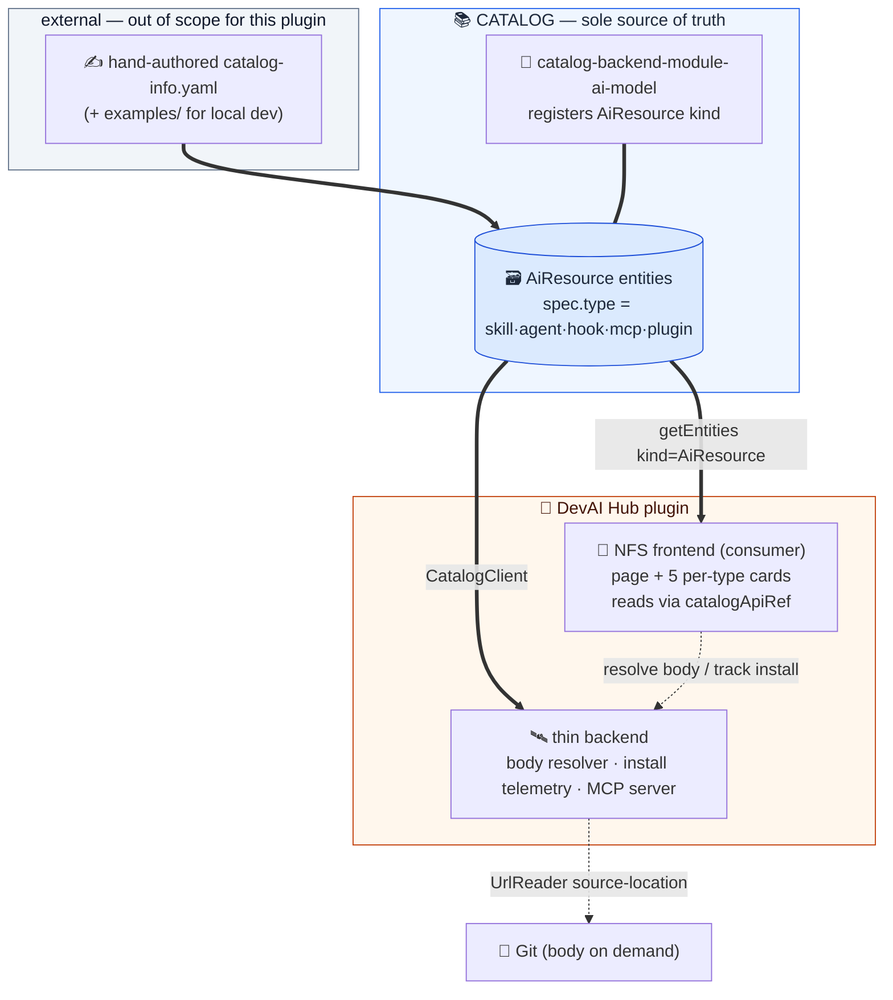

# DevAI Hub → `AiResource` Catalog Refactor — Plan

> Supersedes the producer-centric design in [.specs/ai-resource-refactor.spec.md](../.specs/ai-resource-refactor.spec.md).
> Decisions captured in [CONTEXT.md](../CONTEXT.md) and [docs/adr/0001–0004](../docs/adr/).
> The plugin is a **pure consumer** of the catalog plus a **thin backend** — it does not produce
> entities.

## 1. What changed from the spec

The spec assumed the plugin would *produce* `AiResource` entities by reading Git. That is removed.

| Spec v0.2 | This plan |
|---|---|
| Plugin produces entities via an EntityProvider (Git sync) | **No producer.** Catalog is the sole source of truth (ADR-0001) |
| Dual-run, then cut over | **Direct consumer build** — no parallel asset store to run alongside |
| Backend = optional MCP reader | **Thin backend = body resolver + install telemetry + MCP server** (ADR-0002) |
| Ingestion via discovery rules (§6.3) | **Hand-authored `catalog-info.yaml`**; `examples/` for local testing (ADR-0004) |
| `spec.frameworks` additive field debate (Q3) | Moot — we only *read*. Best-effort `getFrameworks()` (ADR-0003) |
| `mcp` modelling fork (Q5) | `AiResource:mcp` canonical v1; `API:mcp-server` seam left for later (ADR-0003) |

Unchanged from the spec: NFS-only frontend, five `spec.type` cards with one colour each,
metadata-only entities, v1.51 baseline, upstream-convergent posture.

## 2. Verified upstream facts (ground truth)

- `AiResource` is in `@backstage/catalog-model/alpha`, registered by
  `@backstage/plugin-catalog-backend-module-ai-model`, since Backstage **v1.51.0**.
- Default `AiResource` spec = `{ type, lifecycle, owner, system? }`; schemas are **strict**.
- Only `skill` (and `rule`, which we don't use) are structured. `skill` spec =
  `{ type, lifecycle, owner, system?, disciplines?, categories?, agents?, dependsOn? }`.
- Frameworks for skills → native `spec.agents`. `dependsOn`→`dependsOn`/`dependencyOf` relations
  are emitted **only** for the `skill` subtype, not the default shape.
- This repo is on `@backstage/catalog-model@1.8.0` (no `AiResource`); deps must move to the v1.51
  line, and the `ai-model` module is not yet installed.

## 3. Target architecture



### Package fates

| Package | Fate |
|---|---|
| `plugin-dev-ai-hub` (frontend) | **Refactor** → NFS consumer: page + 5 cards, reads catalog |
| `plugin-dev-ai-hub-backend` | **Slim down** → body resolver + install telemetry + catalog-backed MCP server. Remove asset store, Git sync, REST asset CRUD, AssetParser |
| `plugin-dev-ai-hub-common` | **Slim down** → type→card registry, framework read resolver, vocab, annotation contract types |
| `plugin-dev-ai-hub-node` | **Review** → external-provider extension point likely retired |
| `catalog-backend-module-dev-ai-hub` (proposed in spec) | **Not built** — no producer |

## 4. The `AiResource` read contract (consumer-facing)

The plugin reads — never writes — entities shaped like this. It documents the shape for producers.

```yaml
apiVersion: backstage.io/v1alpha1
kind: AiResource              # always
metadata:
  name: code-review
  title: Code Review          # → card title
  description: ...            # → card body
  tags: [review, quality]     # → card tags + filter
  annotations:
    backstage.io/source-location: url:https://github.com/org/repo/blob/main/skills/code-review/SKILL.md
    devaihub/version: "1.0.0"
    devaihub/compatible-frameworks: "claude-code,cursor"   # non-skill framework read
spec:
  type: skill                 # ∈ {skill, agent, hook, mcp, plugin} → selects the card
  lifecycle: production
  owner: group:ai-platform-team
  agents: [claude-code]       # skill only — native framework read
```

- **Framework read** (`getFrameworks(entity)` in `-common`, shared by cards + MCP): skill →
  `spec.agents`; else → `devaihub/compatible-frameworks` annotation; else → `[]`. Unknown tokens
  pass through. Absent → no badges, entity still shown.
- **Body** is never in the entity → resolved on demand from `source-location` via the backend.
- **`plugin` containment**: `plugin` entities reference children. Because `dependsOn` relations are
  not emitted for the default shape, the `PluginCard` reads children via a documented relation/
  annotation convention; verify the exact mechanism in Phase 1 and add a small processor only if a
  hand-authored convention proves insufficient.
- **MCP seam**: `AiResource:mcp` today; leave the query + card registry open to also read
  `API:mcp-server` (`spec.remotes: [{type,url}]`) later, additively.

## 5. Phased roadmap

```mermaid
flowchart LR
  P0["🧪 Phase 0<br/>Baseline & kind live"] --> G0{{"AiResource renders<br/>from examples/"}}
  G0 --> P1["📖 Phase 1<br/>Read contract + -common"]
  P1 --> G1{{"getFrameworks +<br/>registry tested"}}
  G1 --> P2["🎨 Phase 2<br/>NFS page + 5 cards"]
  P2 --> G2{{"browse+filter parity"}}
  G2 --> P3["🛰️ Phase 3<br/>Thin backend"]
  P3 --> G3{{"body resolve +<br/>telemetry + MCP"}}
  G3 --> P4["🧹 Phase 4<br/>Delete legacy silo"]
  P4 --> G4{{"only telemetry<br/>plugin-owned"}}
  G4 --> P5["🔄 Phase 5<br/>Upstream convergence"]

  style P0 fill:#EFF6FF,stroke:#2563EB,color:#1E293B
  style P1 fill:#EFF6FF,stroke:#2563EB,color:#1E293B
  style P2 fill:#FFF7ED,stroke:#C2410C,color:#431407
  style P3 fill:#FAF5FF,stroke:#7C3AED,color:#3B0764
  style P4 fill:#F0FDF4,stroke:#16A34A,color:#14532D
  style P5 fill:#F1F5F9,stroke:#64748B,color:#0F172A
  style G0 fill:#FEF9C3,stroke:#CA8A04,color:#713F12
  style G1 fill:#FEF9C3,stroke:#CA8A04,color:#713F12
  style G2 fill:#FEF9C3,stroke:#CA8A04,color:#713F12
  style G3 fill:#FEF9C3,stroke:#CA8A04,color:#713F12
  style G4 fill:#FEF9C3,stroke:#CA8A04,color:#713F12
```



### Phase 0 — Baseline & kind live
- Move `@backstage/*` deps to the **v1.51.0** line; confirm the workspace builds.
- Add `@backstage/plugin-catalog-backend` + `@backstage/plugin-catalog-backend-module-ai-model` to
  the backend `dev/` harness; allow `AiResource` in `catalog.rules`.
- Create `examples/` with one `AiResource` `catalog-info.yaml` per type (5 files) + a `Location`;
  register it in the dev harness.
- **Exit:** the five example entities appear via `catalog getEntities kind=AiResource`.

### Phase 1 — Read contract + `-common`
- In `-common`: the type→card registry (type, icon, colour role), `getFrameworks(entity)`, the
  framework vocabulary, and TS types for the annotation contract. Remove asset-DB types.
- Unit-test `getFrameworks` (skill native, annotation fallback, absent → `[]`, unknown pass-through).
- **Exit:** registry + resolver covered by tests; no dependency on the old asset model.

### Phase 2 — NFS page + cards
- NFS wiring (manual): `createFrontendPlugin` + `PageBlueprint`, `/alpha` entrypoint, route ref,
  sidebar via `title`+`icon` (no `NavItemBlueprint`).
- Page reads `kind=AiResource`, groups by `spec.type`, renders the five cards (swappable),
  framework badges, type/framework filters, `PluginCard` children, "View source", and a proper
  **empty state** when the catalog has none.
- **Exit:** browse + filter parity with today's section, sourced entirely from the catalog.

### Phase 3 — Thin backend
- Strip the backend to: **body resolver** (`getEntityByRef` → `source-location` → `UrlReader`,
  + zip assembly for resource-bearing skills), **install telemetry** (one counter table keyed by
  entity ref), and the **catalog-backed MCP server** (`CatalogClient` for list/search/get, body
  resolver for install).
- Wire frontend install/copy/download/VS-Code flows to the resolver.
- **Exit:** copy/download/install and the MCP tools work end-to-end against catalog data.

### Phase 4 — Delete the legacy silo
- Remove `AiAssetStore`, `AiAssetSyncService`, `AssetParser`, REST asset CRUD, migrations for asset
  tables (keep only the telemetry table), and now-dead `-common`/`-node` types.
- **Exit:** nothing but install telemetry is plugin-owned. The "no siloed components" milestone.

### Phase 5 — Upstream convergence (ongoing)
- Structured subtype ships for `agent`/`hook`/`mcp`/`plugin` → read native fields, retire the
  annotation read for that type.
- Content-reference lands (backstage/backstage#34318) → drop the body resolver.
- `AiResource` graduates from alpha → remove `/alpha` adapters + version pins.
- Activate the `API:mcp-server` read seam if Backstage-native MCP entities become common.

## 6. Open (non-blocking) questions

| # | Question | Disposition |
|---|---|---|
| Q1 | Final annotation namespace (`devaihub/…`) | Pick the published reverse-DNS namespace before Phase 1 ends |
| Q6 | Legacy `instruction`/`workflow`/`prompt`/`bundle` | Not among the five; an entity only appears if authored as one of the five. No migration we own |
| Q7 | Card colours → which theme tokens | Build-time; bind in Phase 2 |
| Q8 | `hook` grain (per file vs per matcher) | Producer's choice; we render whatever entities exist |
| — | `examples/` contents | At least one per type + one composite `plugin` with children, for Phase 0 |
