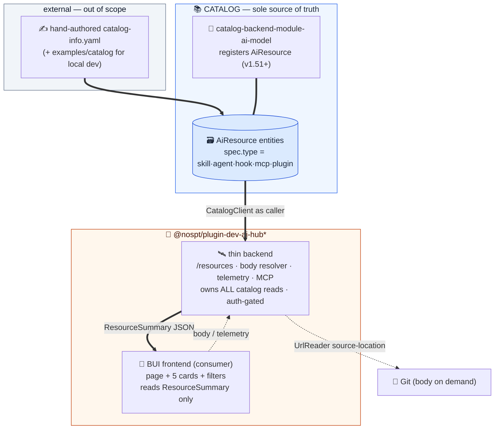

# DevAI Hub v2 → `AiResource` Catalog Consumer — Rebuild Plan (main-nos)

> **Branch:** `dev-ai-hubv2` (off `main-nos`) · **Namespace:** `@nospt/*` · **UI:** Backstage UI (BUI)
> **Approach:** rebuild from scratch following this plan. The implementation on
> `refactor/ai-resource-consumer` (forked-`main` lineage) is a **proven reference only** — not
> ported. Cherry-picking is not viable: the branches diverged before the refactor (namespace
> rename to `@nospt`, BUI migration, Playwright e2e, per-plugin dev harnesses).
> **Conclusions carried over:** ADR-0001–0007, `docs/architecture.md`, `docs/AIRESOURCE-SPEC.md`,
> and `.specs/ai-resource-refactor.{plan,spec}.md`. Where this plan and those docs disagree, the
> **ADRs + `architecture.md` win** (they are the ratified conclusions).

## 1. Why a new plan (main-nos ≠ the reference lineage)

`main-nos` already carries the **conclusions** (ADRs, architecture, specs) but **none of the
implementation**. It is the *legacy asset-store* build plus NOS platform work. The reference
lineage was already on Backstage v1.51 with the refactor done; `main-nos` is not. The deltas that
reshape the roadmap:

| Concern | Reference lineage (`refactor/ai-resource-consumer`) | This branch (`dev-ai-hubv2`) |
|---|---|---|
| Backstage line | v1.51 (AiResource available) | **~1.44/1.45 — below the v1.51 floor** |
| `AiResource` kind | registered | **absent** (`@backstage/catalog-model` not even a dep) |
| Namespace | `@julianpedro/*` | `@nospt/*` |
| Frontend UI | (reference) | **Backstage UI (`@backstage/ui`) + `@remixicon/react`** |
| App harness | `packages/app` + `packages/backend` | **none** — dev harness in each plugin's `dev/` |
| Backend | thin catalog consumer | **legacy asset store** (sync, parser, store-backed MCP, migrations 001–006, unauthenticated) |
| Common | ResourceType + `getFrameworks` | **`AssetType` union, `AiAsset*`, schemas, installPaths** |
| Node | (retired) | **`devAiHubProviderExtensionPoint` present** |
| E2E | none | **5 Playwright specs keyed to the legacy asset model** |

**The load-bearing new constraint: the Backstage upgrade to ≥ v1.51 is a hard prerequisite for
everything else** and is the single biggest risk in this rebuild.

## 2. Ratified conclusions (unchanged — do not relitigate)

From the ADRs + `architecture.md`:

- **ADR-0001** Catalog is the sole source of truth; entities are metadata-only; body stays in Git.
- **ADR-0002** The backend is intentionally thin: **body resolver + install telemetry + MCP**. No asset store, no REST CRUD, no Git enumeration.
- **ADR-0003** Five `spec.type` values: `skill · agent · hook · mcp · plugin`. Framework read: skill → `spec.agents`; else → `devaihub.io/compatible-frameworks` annotation; else `[]`. *(Amended by ADR-0010: a sixth value, `marketplace` — a plugins-only container above `plugin`.)*
- **ADR-0004** Ingestion is hand-authored `catalog-info.yaml` (+ `examples/`), never plugin-owned.
- **ADR-0005** All backend routes require Backstage authentication.
- **ADR-0006** Body reads re-fetch the entity **as the calling user** — body inherits catalog visibility.
- **ADR-0007** Telemetry is store-all, dedup at read; caller recorded as a salted one-way hash.
- **architecture.md** The **backend owns every catalog read** and returns a flat `ResourceSummary`; the frontend imports no `@backstage/catalog-model` / `plugin-catalog-react`. *(This supersedes `.specs/ai-resource-refactor.plan.md` §5.2, which had the frontend reading `catalogApiRef` directly.)*

### The `ResourceSummary` flat contract (backend → frontend)

```typescript
interface ResourceSummary {
  entityRef: string;
  name: string;
  title?: string;
  description?: string;
  tags: string[];
  type: ResourceType;          // 'skill' | 'agent' | 'hook' | 'mcp' | 'plugin' | 'marketplace' (ADR-0010)
  lifecycle: string;
  owner?: string;
  sourceLocation?: string;
  frameworks: string[];
  version?: string;
  kind: string;
  childCount?: number;         // plugin dependsOn count
  helpText?: string;
  annotations: Record<string, string>;
}
```

## 3. Target architecture (this branch)



### Package fates

| Package | Fate |
|---|---|
| `@nospt/plugin-dev-ai-hub` (frontend) | **Rebuild** the page on BUI as a `ResourceSummary` consumer (page + 5 cards + filters + detail/install). Keep NFS wiring; retire legacy page + `pluginLegacy.ts`. |
| `@nospt/plugin-dev-ai-hub-backend` | **Replace** the asset store with: `/resources` (catalog read → `ResourceSummary`), body resolver, install telemetry, catalog-backed MCP. Auth-gate all routes. |
| `@nospt/plugin-dev-ai-hub-common` | **Replace** `AssetType`/`AiAsset*`/schemas with: `ResourceType` + type→card registry, `getFrameworks`, framework vocab, annotation contract, `ResourceSummary` type, ResourceType install paths. |
| `@nospt/plugin-dev-ai-hub-node` | **Retire** `devAiHubProviderExtensionPoint` (no producer). |
| `examples/` | **Add** `examples/catalog/*.yaml` — one `AiResource` per type + a `Location`. Legacy envelope+body pairs retired. |
| Playwright e2e | **Rewrite** the 5 specs from the asset model to the `AiResource`/`ResourceSummary` model. |
| `docs/` | **Add** `CONTEXT.md` (domain glossary the agent docs reference) — currently absent. |

## 4. Phased roadmap

```mermaid
flowchart LR
  P0["🧪 Phase 0<br/>Upgrade ≥1.51<br/>+ kind live + examples"] --> P1["📖 Phase 1<br/>Read contract in -common"]
  P1 --> P2["🛰️ Phase 2<br/>Thin backend<br/>/resources · body · telemetry · MCP"]
  P2 --> P3["🎨 Phase 3<br/>BUI consumer page + 5 cards"]
  P3 --> P4["🧹 Phase 4<br/>Delete legacy silo + rewrite e2e"]
  P4 --> P5["� Phase 5<br/>GitHub card enrichment (deferred)"]
  P5 --> P6["🔄 Phase 6<br/>Upstream convergence"]

  style P0 fill:#EFF6FF,stroke:#2563EB,color:#1E293B
  style P1 fill:#EFF6FF,stroke:#2563EB,color:#1E293B
  style P2 fill:#FAF5FF,stroke:#7C3AED,color:#3B0764
  style P3 fill:#FFF7ED,stroke:#C2410C,color:#431407
  style P4 fill:#F0FDF4,stroke:#16A34A,color:#14532D
  style P5 fill:#ECFEFF,stroke:#0E7490,color:#083344
  style P6 fill:#F1F5F9,stroke:#64748B,color:#0F172A
```



### Phase 0 — Upgrade to ≥ v1.51 & kind live *(prefactor — everything depends on this)*

- Bump all `@backstage/*` deps from ~1.44/1.45 to the **v1.51.0** line across the four `@nospt`
  packages (use the `backstage-upgrade` skill / `backstage-cli versions:bump`). Confirm the
  workspace builds and existing tests pass.
- Add `@backstage/catalog-model` and, to the backend `dev/` harness,
  `@backstage/plugin-catalog-backend` + `@backstage/plugin-catalog-backend-module-ai-model`.
  Allow `AiResource` in `catalog.rules`.
- Create `examples/catalog/` with one `AiResource` `catalog-info.yaml` per type (5) + a `Location`;
  register in the dev harness.
- Add `docs/CONTEXT.md` (domain glossary) so agent docs resolve.
- **Exit:** the five example entities appear via `catalog getEntities kind=AiResource`; app builds on 1.51.

### Phase 1 — Read contract in `-common`

- In `-common`: `ResourceType` vocab + type→card registry (type, icon, colour role), `getFrameworks(entity)`,
  the framework vocabulary, the `ResourceSummary` type, annotation contract types, and ResourceType
  install paths. Remove nothing yet (legacy types stay until Phase 4 to keep the build green).
- Unit-test `getFrameworks` (skill native, annotation fallback, absent → `[]`, unknown pass-through).
- **Exit:** registry + resolver covered by tests; `ResourceSummary` + framework read available to consumers.

### Phase 2 — Thin backend (owns all catalog reads)

- `GET /api/dev-ai-hub/resources` → `catalogClient.getEntities({ filter: { kind: 'AiResource' } })`
  **as the caller** → `toResourceSummary()` → `{ items }`.
- Body resolver: `GET /entity/:ref/raw` (+ `/:filename`) → `getEntityByRef` as caller →
  `backstage.io/source-location` → `UrlReader` → stream; zip assembly for resource-bearing skills;
  404 on missing/no-access (ADR-0006).
- Install telemetry: `POST /telemetry` + `GET /telemetry/:ref` (store-all, read-time dedup, salted
  actor hash) + one telemetry migration. `view` deduped per (hash, day); deliberate actions raw.
- Catalog-backed MCP: `list/search/get` via `CatalogClient`, `install` via body resolver; session
  idle-TTL + hard cap.
- **All routes require Backstage auth** (ADR-0005).
- **Exit:** `/resources`, body resolve, telemetry, and MCP tools work end-to-end against catalog data.

### Phase 3 — BUI consumer page + five cards

- New/rebuilt API client: `getResources()→ResourceSummary[]`, `getEntityBody`, `getEntityBodyUrl`,
  `track`, `getInstallCount`.
- BUI page (grouped by `spec.type`): five per-type cards (one colour each), framework badges,
  type/framework/tag filters, `PluginCard` children (from `childCount`/relations), "View source",
  a proper **empty state**, detail panel, and copy/download/install flows wired to the resolver.
- Point the NFS `PageBlueprint` at the new page; retire the legacy page mount (deletion in Phase 4).
- **Exit:** browse + filter parity with today's section, sourced entirely from the catalog via the backend.

### Phase 4 — Delete the legacy silo + rewrite e2e

- Remove `AiAssetStore`, `AiAssetSyncService`, `AssetParser`, store-backed `McpServerService`, the
  asset REST routes, migrations `001–006` (keep only the telemetry migration), the node
  `devAiHubProviderExtensionPoint`, legacy `-common` types/schemas/`installPaths`, `pluginLegacy.ts`,
  and the unused `@mui/*` deps.
- Rewrite the 5 Playwright specs from the asset model to the `AiResource`/`ResourceSummary` model.
- **Exit:** only install telemetry is plugin-owned; e2e green against `AiResource`.

### Phase 5 — GitHub card enrichment (deferred, additive)
>
> Ingestion (Phases 0–3) reads only the catalog. Enrichment is a **separate, later** step that
> decorates cards with GitHub-sourced data the entity does not carry. It is **not** the body
> resolver: the body resolver streams full markdown on a user action (open/install); enrichment
> augments card metadata at browse/detail time. It reuses the same `source-location` + `UrlReader`
> plumbing but is its own concern.

- **ADR-0001 guardrail:** enrichment is **decorative and read-time only** — cached with a TTL,
  never persisted as a system of record. A card must fully render from the catalog `ResourceSummary`
  alone; enrichment fields are optional add-ons.
- **The card/detail description is a catalog field, not enrichment.** Title and description come
  from the entity's `metadata.title`/`metadata.description` (carried in `ResourceSummary`), so the
  detail panel renders fully from the catalog. Enrichment (Q6) must **not** source the description
  from GitHub — it only *adds* adornments (e.g. last-updated, stars) on top.
- **Backend-owned (architecture.md):** the frontend never talks to GitHub. Enrichment is resolved
  server-side, **as the calling user** (ADR-0006), and returned as additive optional fields.
- **Shape:** a lazy, per-resource endpoint (e.g. `GET /api/dev-ai-hub/resources/:ref/enrichment`)
  so the browse list (`/resources`) stays fast; the frontend fetches enrichment on card render /
  detail open and renders it only when present.
- **Graceful degradation:** no `source-location`, GitHub unreachable, rate-limited, or private →
  the card silently renders without the extras (no error surface).
- **Exit:** cards show at least one GitHub-derived field (per Q6) behind a TTL cache; browse works
  identically with enrichment disabled or unavailable.

### Phase 6 — Upstream convergence (ongoing)

- Structured subtypes for `agent`/`hook`/`mcp`/`plugin` → read native fields, retire annotation reads.
- Content-reference upstream (backstage/backstage#34318) → drop the body resolver.
- `AiResource` graduates alpha → drop `/alpha` adapters + version pins.

## 5. Open (non-blocking) questions

| # | Question | Disposition |
|---|---|---|
| Q1 | Target v1.51 patch + upgrade path (single bump vs stepwise) | Decide at Phase 0 start; prefer `backstage-cli versions:bump` to the latest ≤1.5x that carries AiResource |
| Q2 | Final annotation namespace | **Resolved (slice 2): `devaihub.io/…`** — DNS-shaped per Backstage convention; docs + examples updated |
| Q3 | BUI colour tokens for the five card roles | **Resolved (ADR-0008): plugin-owned `--devaihub-type-*` tokens** layered on BUI's `[data-theme-mode]` attribute — BUI 0.15 has only four semantic colours, so five roles cannot bind to BUI tokens directly |
| Q4 | `plugin` children mechanism (native `dependsOn` relations vs annotation convention) | Verify in Phase 2; add a tiny processor only if hand-authored convention is insufficient |
| Q5 | Keep `packages/backend` stale `dist/` or delete | House-keeping; delete when convenient |
| Q6 | Which GitHub fields enrich the card (last-updated · README excerpt · repo stars/forks · contributors · extra frontmatter) — **excludes title/description, which are catalog fields** | Decide at Phase 5 start; ship the smallest useful set first |
| Q7 | Enrichment cache: in-memory TTL vs a small persisted cache table (with TTL, still not truth) | Prefer in-memory TTL first; add a cache table only if GitHub rate limits bite |
| Q8 | Enrichment auth to GitHub: per-user token vs a shared integration token | Prefer the configured `integrations` token via `UrlReader`; per-user only if private-repo visibility must be enforced per caller |
| Q9 | Server-side pagination/search for `/resources` | Deferred — the browse page loads the full summary list and paginates/searches client-side (24/page, slice 3); revisit if real catalogs outgrow a single response |

## 6. Issue slices (locked — tracer bullets)

Vertical slices published to `nosportugal/backstage-plugin-dev-ai-hub`. Slice 1 is unavoidable
prefactoring (the upgrade). Slices 2–7 each cut end-to-end through catalog → backend → `-common` →
BUI frontend. Slice 8 tears down the legacy silo. Slice 9 (enrichment) is deferred.

| # | Title | Phase(s) | Blocked by |
|---|---|---|---|
| 1 | Upgrade to Backstage ≥ 1.51, register `AiResource`, seed examples | 0 | — |
| 2 | End-to-end browse: catalog → `/resources` → `ResourceSummary` → minimal BUI list | 1·2·3 | 1 |
| 3 | Five per-type cards: colours, framework badges, View source, empty state | 3 | 2 |
| 4 | Body resolution: view / copy / download / install a resource | 2·3 | 2 |
| 5 | Install telemetry: store-all + read-time dedup + count display | 2·3 | 2 |
| 6 | PluginCard containment end-to-end | 3 | 3 |
| 7 | Catalog-backed MCP server (auth-gated, TTL + cap) | 2 | 2 |
| 8 | Delete legacy silo + rewrite Playwright e2e for `AiResource` | 4 | 3·4·5·6·7 |
| 9 | GitHub card enrichment (deferred, additive) | 5 | 3 |
| 10 | `marketplace` sixth ResourceType: vocab, card, example, spec (ADR-0010) | 3 | 3 |

Slices 1–8 and 10 ship as `ready-for-agent`. Slice 9 is tracked but **deferred** — not started
until the core lands.

**Ordering amendment (ADR-0010, 2026-07-14):** slice 10 executes **before** slices 6 (#32) and
8 (#34): the children-section machinery (#32) is then built once, generically for both container
types (`plugin` → skill/agent/hook/mcp, `marketplace` → plugin), and the rewritten Playwright
suite (#34) encodes six types from the start instead of being touched twice. Slice 10 itself
excludes the children section — that stays in #32.
