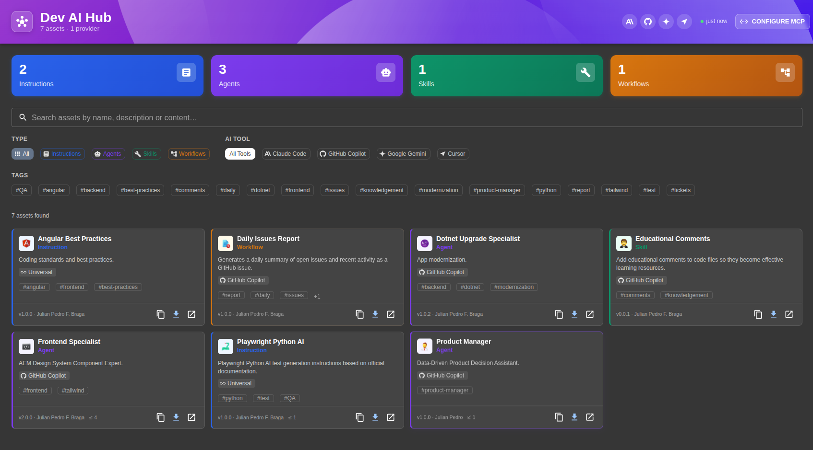

# Dev AI Hub — Backstage Plugin

A centralized hub for AI assets — Instructions, Agents, Skills, and Workflows — usable by **GitHub Copilot**, **Claude Code**, **Google Gemini**, **Cursor**, and other AI coding tools.

The plugin syncs one or more Git repositories as the source of truth, stores assets in your Backstage database, exposes them via a rich UI, and serves them over an embedded **MCP (Model Context Protocol) server** so AI tools can discover and install assets automatically.



---

## Features

- Browse, search, and filter AI assets by type, tool, and tags
- Sync assets from GitHub, GitLab, Bitbucket, Azure DevOps, or any Git provider
- Embedded MCP server (StreamableHTTP) — no separate process needed
- AI tools discover and install assets directly via MCP
- Install dialog with per-tool path conventions (copy or download)
- Usage metrics — tracks how many times each asset has been installed
- Live sync status and asset statistics in the page header

---

## Asset Format

Each AI asset is two files with the same base name in the repository:

```
agents/
  product-manager.yaml   ← metadata envelope
  product-manager.md     ← pure markdown content (never modified)
instructions/
  security-guidelines.yaml
  security-guidelines.md
skills/
  code-review/
    code-review.yaml
    SKILL.md
workflows/
  pr-review.yaml
  pr-review.md
```

### YAML envelope (`<name>.yaml`)

```yaml
name: Product Manager Agent
description: AI agent specialized in product management tasks
type: agent                          # instruction | agent | skill | workflow
tools:
  - claude-code
  - github-copilot
tags:
  - product
  - planning
author: Your Name
version: 1.0.0

# Optional: override install path per tool
# installPath: ".claude/agents/product-manager.md"
# installPaths:
#   claude-code: ".claude/agents/product-manager.md"
#   github-copilot: ".github/agents/product-manager.agent.md"

# Agent-specific
model: claude-opus-4-5

# Instruction-specific
# applyTo: "src/**/*.ts"
```

The `content` field is optional — if omitted, the parser looks for `<same-name>.md` in the same directory. For skills, it defaults to `SKILL.md`.

### Install path conventions (auto-resolved per tool)

| Type | Tool | Default path |
|------|------|-------------|
| `instruction` | `claude-code` | `.claude/rules/<name>.md` |
| `instruction` | `github-copilot` | `.github/instructions/<name>.instructions.md` |
| `instruction` | `google-gemini` | `GEMINI.md` |
| `instruction` | `cursor` | `.cursor/rules/<name>.mdc` |
| `agent` | `claude-code` | `.claude/agents/<name>.md` |
| `agent` | `github-copilot` | `.github/agents/<name>.agent.md` |
| `skill` | `claude-code` | `.claude/skills/<name>/SKILL.md` |
| `skill` | `cursor` | `.cursor/skills/<name>/SKILL.md` |
| `workflow` | `claude-code` | `.claude/workflows/<name>.md` |
| `workflow` | `github-copilot` | `.github/workflows/<name>.workflow.md` |

Use `tools: [all]` for tool-agnostic assets that should appear for every tool.

---

## Installation

### 1. Copy the plugin packages

Copy the four plugin directories into your Backstage monorepo's `plugins/` folder:

```
plugins/
  dev-ai-hub/
  dev-ai-hub-backend/
  dev-ai-hub-common/
  dev-ai-hub-node/
```

### 2. Register the packages

Add the plugins to your root `package.json` workspaces (if not auto-discovered) and install:

```bash
yarn install
```

### 3. Register the backend plugin

In `packages/backend/src/index.ts`:

```typescript
backend.add(import('@internal/plugin-dev-ai-hub-backend'));
```

### 4. Register the frontend plugin

#### Classic Backstage frontend system

In `packages/app/src/App.tsx`, add the route:

```typescript
import { DevAiHubPage } from '@internal/plugin-dev-ai-hub';

// Inside <FlatRoutes>:
<Route path="/dev-ai-hub" element={<DevAiHubPage />} />
```

In `packages/app/src/components/Root/Root.tsx`, add the sidebar item:

```typescript
import HubIcon from '@mui/icons-material/Hub';

// Inside <SidebarGroup>:
<SidebarItem icon={HubIcon} to="dev-ai-hub" text="AI Hub" />
```

### 5. Configure `app-config.yaml`

```yaml
devAiHub:
  providers:
    - id: "main-ai-assets"
      type: "github"                                          # github | gitlab | bitbucket | azure-devops | git
      target: "https://github.com/your-org/ai-assets.git"
      branch: "main"
      schedule:
        frequency:
          minutes: 30
        timeout:
          minutes: 5
      # Optional filters
      # filters:
      #   tools: [claude-code, github-copilot]
      #   types: [agent, instruction]

    # GitLab example
    # - id: "gitlab-assets"
    #   type: "gitlab"
    #   target: "https://gitlab.example.com/your-group/ai-assets.git"
    #   branch: "main"
    #   schedule:
    #     frequency:
    #       hours: 1
    #     timeout:
    #       minutes: 10

# Required: Git integration for reading repositories
integrations:
  github:
    - host: github.com
      token: ${GITHUB_TOKEN}

  # GitLab example
  # gitlab:
  #   - host: gitlab.example.com
  #     token: ${GITLAB_TOKEN}
```

---

## MCP Server

The MCP server runs **embedded** in the Backstage backend — no separate process is needed. It uses the StreamableHTTP transport.

**Base URL:** `http://<backstage-host>:7007/api/dev-ai-hub/mcp`

The `?tool=` query parameter filters which assets the AI tool receives. Omit it to receive all assets.

### Claude Code

In `.mcp.json` or `~/.claude/mcp.json`:

```json
{
  "mcpServers": {
    "dev-ai-hub": {
      "type": "http",
      "url": "http://<backstage-host>:7007/api/dev-ai-hub/mcp?tool=claude-code"
    }
  }
}
```

### GitHub Copilot (VS Code)

In `.vscode/settings.json` or VS Code user settings:

```json
{
  "mcp.servers": {
    "dev-ai-hub": {
      "type": "http",
      "url": "http://<backstage-host>:7007/api/dev-ai-hub/mcp?tool=github-copilot"
    }
  }
}
```

### Google Gemini CLI

In `~/.gemini/settings.json`:

```json
{
  "mcpServers": {
    "dev-ai-hub": {
      "type": "http",
      "url": "http://<backstage-host>:7007/api/dev-ai-hub/mcp?tool=google-gemini"
    }
  }
}
```

### Cursor

In `.cursor/mcp.json`:

```json
{
  "mcpServers": {
    "dev-ai-hub": {
      "type": "http",
      "url": "http://<backstage-host>:7007/api/dev-ai-hub/mcp?tool=cursor"
    }
  }
}
```

### MCP Tools

| Tool | Description |
|------|-------------|
| `search_assets` | Full-text search across name, description, and content |
| `list_assets` | List available assets, optionally filtered by type |
| `get_asset` | Get full metadata and markdown content by ID or name |
| `install_asset` | Get content + recommended install path; the model creates the file |

### Using the MCP in chat

Talk to your AI tool naturally:

> "List the available agents in Dev AI Hub"
> "Search for a code review asset in the hub"
> "Install the Product Manager agent in this project"

When you ask to install, the model calls `install_asset`, receives the pure markdown content and the correct path for its tool (e.g., `.claude/agents/product-manager.md`), and creates the file directly.

---

## REST API

```
GET  /api/dev-ai-hub/assets                   List assets (filters: type, tool, tags, search, provider, page, pageSize)
GET  /api/dev-ai-hub/assets/:id               Asset detail
GET  /api/dev-ai-hub/assets/:id/raw           Pure markdown content
GET  /api/dev-ai-hub/assets/:id/download      Download as .md or .zip (skills)
POST /api/dev-ai-hub/assets/:id/track-install Increment install counter
GET  /api/dev-ai-hub/providers                List configured providers with sync status
POST /api/dev-ai-hub/providers/:id/sync       Trigger manual sync
GET  /api/dev-ai-hub/stats                    Totals by type, tool, and provider

POST   /api/dev-ai-hub/mcp                    Initialize MCP session or handle existing
GET    /api/dev-ai-hub/mcp                    SSE stream for server-to-client notifications
DELETE /api/dev-ai-hub/mcp                    Terminate MCP session
```

---

## Package Structure

| Package | Role | Description |
|---------|------|-------------|
| `@internal/plugin-dev-ai-hub` | `frontend-plugin` | React UI — page, cards, filters, install dialog |
| `@internal/plugin-dev-ai-hub-backend` | `backend-plugin` | Sync service, REST API, embedded MCP server |
| `@internal/plugin-dev-ai-hub-common` | `common-library` | Shared TypeScript types, Zod schemas, install path conventions |
| `@internal/plugin-dev-ai-hub-node` | `node-library` | Extension points for external modules |

---

## Development

```bash
# Install dependencies
yarn install

# Build all packages
yarn build:all

# Build a specific package
yarn workspace @internal/plugin-dev-ai-hub-backend build

# Lint
yarn lint:all

# Type check
yarn tsc

# Run tests
yarn test
```

---

## Database

The backend uses Backstage's database service (SQLite in development, PostgreSQL in production). Migrations run automatically on startup.

Tables:
- `ai_assets` — asset catalog with content, metadata, and install path overrides
- `ai_asset_sync_status` — sync state per provider

No manual database setup is required.

---

## License

Apache-2.0
