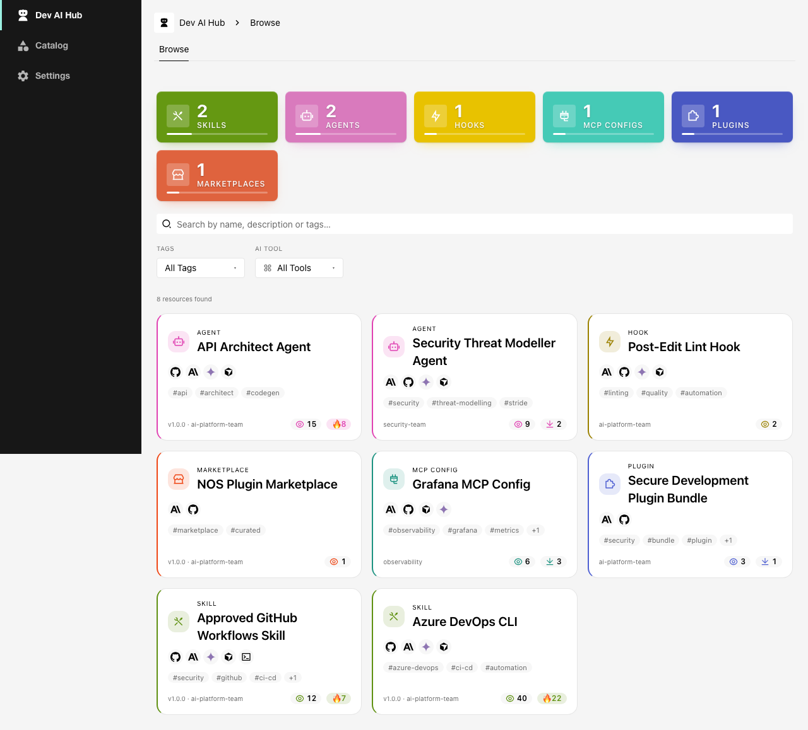
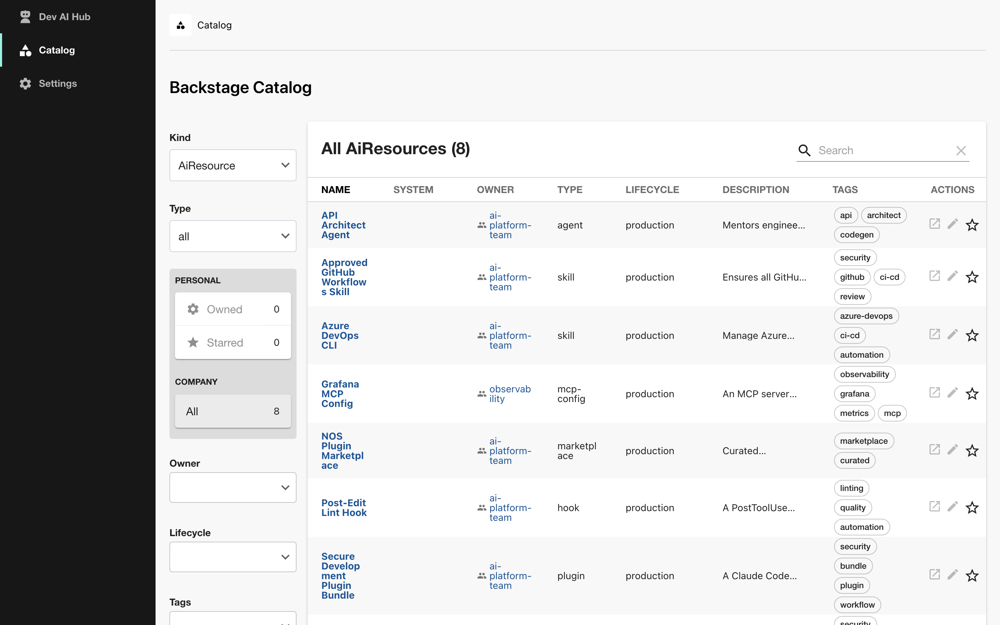
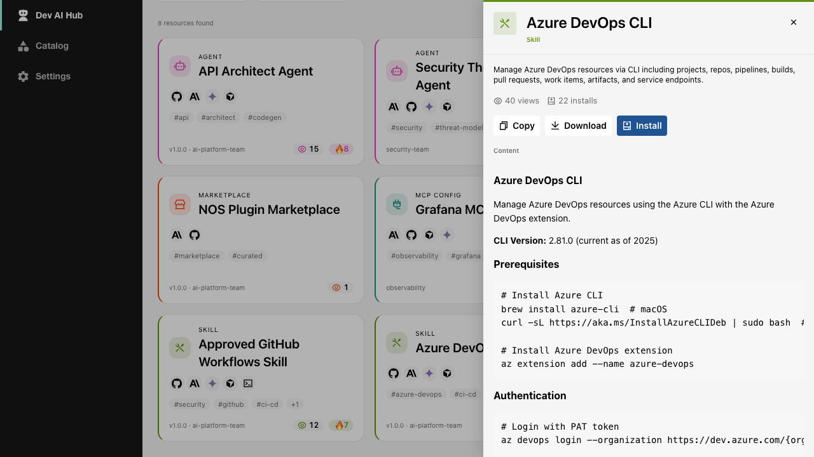
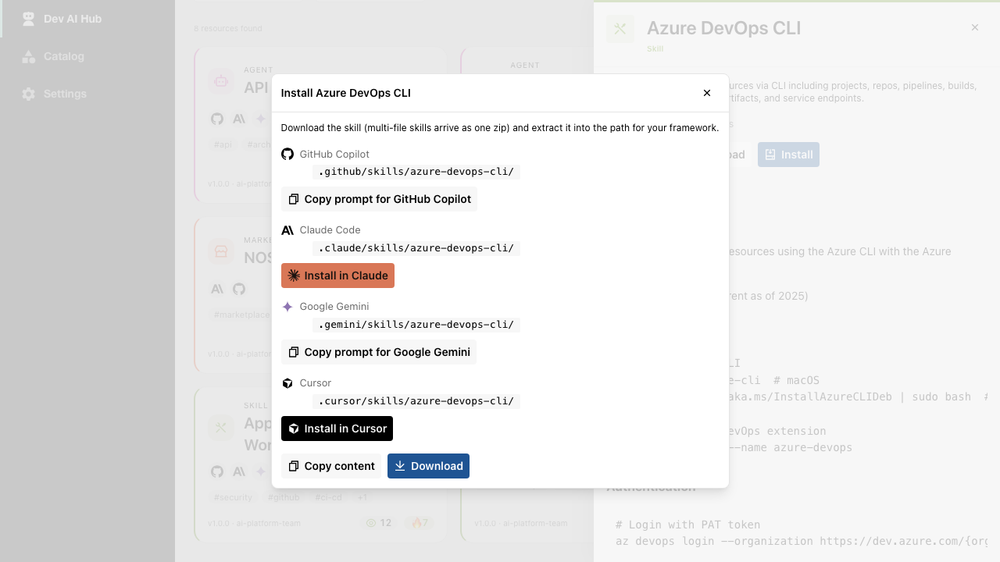

# Dev AI Hub — Backstage Plugin

A catalog-backed browser for AI assets — **Skills**, **Agents**, **Hooks**, **MCP Configs**, **Plugins**, and **Marketplaces** — usable by **GitHub Copilot**, **Claude Code**, **Google Gemini**, **Cursor**, and other AI coding tools.

The Backstage **catalog** is the sole source of truth: entities are hand-authored `AiResource` catalog-info entries (or emitted by your own EntityProviders) pointing at content that lives in Git. The plugin never stores a second copy — the backend reads the catalog on demand, resolves each resource's body from its `source-location`, and records lightweight install/view telemetry. There's no sync service and no embedded MCP server.



---

## Installation

**Requires Backstage 1.54 or later** — the `AiResource` kind comes from Backstage's own alpha
catalog module, and these packages depend on `@backstage/catalog-model@^1.10.0`, first shipped in
1.54.0 along with the `plugin` and `marketplace` subtypes.

### 1. Install the packages

The packages are published publicly on npm under the `@nospt` scope, so nothing needs copying into
your monorepo and no registry configuration is required:

```bash
yarn --cwd packages/app add @nospt/plugin-dev-ai-hub
yarn --cwd packages/backend add @nospt/plugin-dev-ai-hub-backend
```

`@nospt/plugin-dev-ai-hub-common` arrives as a dependency of both — you never install it directly.

### 2. Register the `AiResource` catalog kind

DevAI Hub consumes `AiResource` entities but doesn't define the kind itself — that comes from Backstage's own alpha catalog module. In `packages/backend/src/index.ts`:

```typescript
backend.add(import('@backstage/plugin-catalog-backend-module-ai-model'));
```

### 3. Register the backend plugin

Still in `packages/backend/src/index.ts`:

```typescript
backend.add(import('@nospt/plugin-dev-ai-hub-backend'));
```

### 4. Register the frontend plugin

DevAI Hub uses the Backstage **New Frontend System**. In `packages/app/src/App.tsx`:

```typescript
import { devAiHubPlugin } from '@nospt/plugin-dev-ai-hub';

export const app = createApp({
  features: [
    // ...existing features
    devAiHubPlugin,
  ],
});
```

The sidebar item and `/dev-ai-hub` route are registered automatically.

The UI is built on Backstage UI design tokens. Apps scaffolded by a current `create-app` already
load them; if yours predates that, make sure `packages/app/src/index.tsx` imports
`@backstage/ui/css/styles.css`, or the components render unstyled.

### 5. Configure `app-config.yaml`

```yaml
catalog:
  rules:
    # AiResource must be allow-listed alongside your other kinds.
    - allow: [Component, API, Resource, System, Domain, Location, AiResource]
  locations:
    # Hand-authored AiResource entities (ADR-0004 — DevAI Hub is a consumer,
    # never a producer). Point this at wherever your org registers them.
    - type: url
      target: https://github.com/your-org/ai-assets/blob/main/catalog-info.yaml
      rules:
        - allow: [AiResource]

devAiHub:
  telemetry:
    # Optional. Salts the per-user hash used to dedup `view` events (ADR-0007).
    # Omit it and the plugin generates one on first start and persists it in
    # its own database. Set it to keep the salt outside that database, or to
    # control rotation — a real secret, never committed, and stable once set.
    salt: ${DEV_AI_HUB_TELEMETRY_SALT}
```

All backend routes require standard Backstage authentication (ADR-0005) — there are no unauthenticated endpoints.

---

## Authoring `AiResource` entities

Each entity is a normal Backstage catalog entry with `kind: AiResource`. The body stays in Git — the entity only carries metadata plus a `backstage.io/source-location` pointer to it. Bodies are type-shaped: markdown for `skill` and `agent`, JSON for `hook`, `mcp-config`, `plugin` and `marketplace` (the last two point at the real `plugin.json` / `marketplace.json` manifest, not a doc about it):

```yaml
apiVersion: backstage.io/v1alpha1
kind: AiResource
metadata:
  name: approved-github-workflows
  title: Approved GitHub Workflows Skill
  description: Ensures all GitHub Actions workflows are reviewed and approved before execution.
  tags: [security, github, ci-cd]
  annotations:
    backstage.io/source-location: url:https://github.com/your-org/ai-assets/tree/main/skills/approved-github-workflows/
spec:
  type: skill # skill | agent | hook | mcp-config | plugin | marketplace
  lifecycle: production
  owner: group:ai-platform-team
  version: 1.0.0
  # Compatible frameworks (native field — honoured for any spec.type, not just
  # `skill`; takes priority over the devaihub.io/compatible-frameworks annotation).
  agents: [github-copilot, claude-code]
```

`plugin` and `marketplace` are container types, and since Backstage 1.54.0 each **must** declare what it contains — `spec.skills` on a `plugin`, `spec.plugins` on a `marketplace`. Omit it and the catalog rejects the entity outright:

```yaml
spec:
  type: plugin
  lifecycle: production
  owner: group:ai-platform-team
  # Required. Despite the name, any AiResource is a legal member — agents,
  # hooks and mcp-configs go in the same list.
  skills:
    - airesource:default/approved-github-workflows
    - airesource:default/post-edit-lint
```

Backstage generates `hasPart`/`partOf` relations from those refs, so containment is queryable in the catalog. The hub's own cards do not render it yet ([issue #32](https://github.com/nosportugal/backstage-plugin-dev-ai-hub/issues/32)).

Registered entities show up in the Backstage catalog like any other kind, filterable by `AiResource`:



### Browsing and installing

Opening a resource shows its resolved body alongside view/install counts, with **Copy**, **Download**
and **Install** actions:



**Install** resolves the convention path for every framework the resource declares, and offers a
one-click launcher where the host exposes one — the rest get a copyable prompt. A `merge` target
(a settings file the user already owns) is never presented as a `drop-in` overwrite:



See [`docs/AIRESOURCE-SPEC.md`](docs/AIRESOURCE-SPEC.md) for the full per-type spec (required vs. recommended fields, the `devaihub.io/*` annotation namespace, and one worked example per type), and [`examples/catalog/`](examples/catalog/) for entities you can register as-is to try the plugin locally.

---

## REST API

```
GET  /api/dev-ai-hub/resources                    List AiResource entities as flat ResourceSummary items
GET  /api/dev-ai-hub/entity/:ref/raw               Resolved body (markdown or JSON, by resource shape)
GET  /api/dev-ai-hub/entity/:ref/raw/:filename     A specific file from a directory-shaped body
GET  /api/dev-ai-hub/entity/:ref/raw?download=true Download the artifact (zipped if multi-file)
POST /api/dev-ai-hub/telemetry                     Record an install/copy/download/view event
GET  /api/dev-ai-hub/telemetry/:ref                 Per-action counts for a resource
```

All routes require Backstage authentication; the frontend never talks to the catalog directly — it only ever sees the flat `ResourceSummary` contract the backend returns.

---

## Package Structure

| Package | Role | Description |
|---------|------|-------------|
| `@nospt/plugin-dev-ai-hub` | `frontend-plugin` | React UI (New Frontend System) — browse page, cards, filters, detail drawer, install dialog |
| `@nospt/plugin-dev-ai-hub-backend` | `backend-plugin` | Reads the catalog on demand, resolves resource bodies, records telemetry |
| `@nospt/plugin-dev-ai-hub-common` | `common-library` | Shared TypeScript types, the `ResourceSummary` contract, and telemetry schemas |

---

## Further reading

- [`docs/1.1.0/CHANGELOG.md`](docs/1.1.0/CHANGELOG.md) — relationship visualization, Backstage 1.54 alignment, and two producer-facing contract changes
- [`docs/0.3.0/CHANGELOG.md`](docs/0.3.0/CHANGELOG.md) — **upgrading from 0.2.x**: breaking changes, route mapping, and known gaps
- [`docs/architecture.md`](docs/architecture.md) — system view and the catalog read flow
- [`docs/CONTEXT.md`](docs/CONTEXT.md) — vocabulary and glossary
- [`docs/AIRESOURCE-SPEC.md`](docs/AIRESOURCE-SPEC.md) — full `AiResource` entity spec
- [`docs/adr/`](docs/adr/) — architecture decision records

---

## License

Apache-2.0
