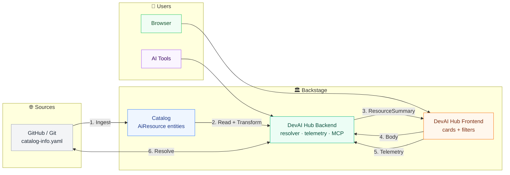

# DevAI Hub Architecture

> Living document. Updated after the `AiResource` catalog refactor (ADR-0001–0007) **and the frontend decoupling** (backend now owns every catalog read).



## Key architectural principles

| Principle | What it means |
|---|---|
| **Catalog is sole source of truth** (ADR-0001) | The Backstage catalog is the *only* place `AiResource` entities live. DevAI Hub never stores a second copy. |
| **Entities are metadata-only** (ADR-0001) | The entity carries title, description, owner, tags, and a `backstage.io/source-location` pointer. The **body** (markdown) stays in Git. |
| **DevAI Hub is a consumer, never a producer** (ADR-0004) | The plugin *reads* entities from the catalog. It never creates, edits, or ingests them. Producers are separate (hand-authored YAML, future EntityProviders). |
| **Body reads inherit catalog visibility** (ADR-0006) | When resolving a body, the backend re-fetches the entity **as the calling user**. If the catalog hides the entity from that user, the body is never served. |
| **Telemetry is store-all, dedup at read** (ADR-0007) | Every event is stored. `install`/`copy`/`download` are counted raw; `view` is counted distinct per (salted-hash-of-user, day) to stop render-loop inflation. |
| **The backend is intentionally thin** (ADR-0002) | Three things only: body resolver, telemetry, and an optional MCP server. No asset store, no REST CRUD, no Git enumeration. |
| **Frontend is dumb; backend owns all catalog reads** | The frontend never talks to the catalog. It receives a flat `ResourceSummary` list from `GET /api/dev-ai-hub/resources`. All extraction, auth validation, and transformation happens server-side. |

## The `ResourceSummary` flat contract

The frontend never sees a raw Backstage `Entity`. The backend transforms every catalog result into a lightweight `ResourceSummary`:

```typescript
interface ResourceSummary {
  entityRef: string;
  name: string;
  title?: string;
  description?: string;
  tags: string[];
  type: ResourceType;          // 'skill' | 'agent' | 'hook' | 'mcp' | 'plugin' | 'marketplace'
  lifecycle: string;
  owner?: string;
  sourceLocation?: string;
  frameworks: string[];
  version?: string;
  kind: string;
  childCount?: number;         // e.g. plugin dependsOn count
  helpText?: string;           // parsed from devaihub.io/help annotation
  annotations: Record<string, string>;
}
```

**Why a flat contract?**
- **Decoupling**: Frontend changes don't break when catalog field paths move (e.g. `spec.type` vs `metadata.annotations`).
- **No catalog imports in frontend**: The frontend package does not import `@backstage/catalog-model` or `@backstage/plugin-catalog-react`. It is purely presentational.
- **Security**: Sensitive annotations or internal fields can be dropped during transformation.
- **Performance**: Only fields the UI actually needs are sent across the wire.

## Catalog read flow

```
┌─────────────────────────────────────────────────────────────┐
│  Browser → GET /api/dev-ai-hub/resources                    │
│                                                            │
│  Backend:                                                  │
│    1. Read caller credentials from httpAuth                │
│    2. catalogClient.getEntities({ kind: 'AiResource' })   │
│    3. For each entity → toResourceSummary()                │
│    4. Return { items: ResourceSummary[] }                  │
│                                                            │
│  Frontend:                                                 │
│    1. useCatalogAiResources() calls api.getResources()     │
│    2. Renders cards, filters, stats from flat fields       │
└─────────────────────────────────────────────────────────────┘
```

For **body resolution** and **telemetry**, the backend performs a **second, targeted** catalog read:

```
GET /api/dev-ai-hub/entity/:ref/raw
  → catalogClient.getEntityByRef(ref, { credentials })
  → 404 if entity missing OR user lacks read access (ADR-0006)
  → fetch markdown from source-location → stream to client
```

## The six entity types

> Colours are the NOS palette per ADR-0008 (`--devaihub-type-*` tokens); marketplace coral
> comes from the in-repo NOS brand reference (ADR-0010).

| Type | Colour | Icon | Upstream structure |
|---|---|---|---|
| `skill` | green `#6AB04C` | 🧠 | Structured (`spec.agents`, `disciplines`, `categories`) |
| `agent` | pink `#FF6B9D` | 🤖 | Default shape + annotations |
| `hook` | yellow `#F9CA24` | 🪝 | Default shape + annotations |
| `mcp` | teal `#00D2D3` | 🔌 | Default shape + annotations |
| `plugin` | blue `#54A0FF` | 🧩 | Default shape + `dependsOn` relations (children: skill/agent/hook/mcp) |
| `marketplace` | coral `#F26B43` | 🏪 | Default shape + `dependsOn` relations (children: plugin only, ADR-0010) |

## Trust model (ADR-0005)

All routes require Backstage authentication by default. The backend is treated as an **internal Backstage service** — it never exposes unauthenticated endpoints. The MCP server's dedicated external-auth model is left as a future follow-up.

## Why the backend owns every catalog read

We considered having the frontend read the catalog directly for the browse list (standard Backstage pattern) and rejected it. Here is why:

| Concern | Frontend → Catalog | Backend → Catalog (chosen) |
|---|---|---|
| **Coupling** | Frontend is coupled to catalog field layout (`spec.type`, `metadata.annotations`, `relations`) | Frontend only knows `ResourceSummary` fields |
| **Tooling** | Frontend pulls in `@backstage/catalog-model` and `@backstage/plugin-catalog-react` | Frontend has zero catalog dependencies |
| **Auth** | Frontend cannot forward user identity for server-side validation | Backend reads as the caller via `httpAuth.credentials(req)` |
| **Body resolution** | Frontend cannot resolve source-location bodies securely | Backend resolves bodies, enforcing catalog visibility per user |
| **Transformation** | Frontend mixes presentation + data extraction logic | Backend centralises extraction in `toResourceSummary()` |

**Trade-off**: The backend adds one network hop for the initial list. That hop is tiny (lightweight JSON, no markdown payload), and the gains in decoupling, security, and maintainability outweigh the cost.

## MCP server lifecycle

The backend can host an optional MCP server. Sessions are bounded:

- **Idle TTL**: Unreferenced `setInterval` sweeps sessions older than a configured TTL (default 10 min).
- **Max cap**: Hard limit on concurrent sessions → `503 Service Unavailable` when exhausted.
- **No persistent state**: Session state is in-memory only; reconnecting clients start fresh.
